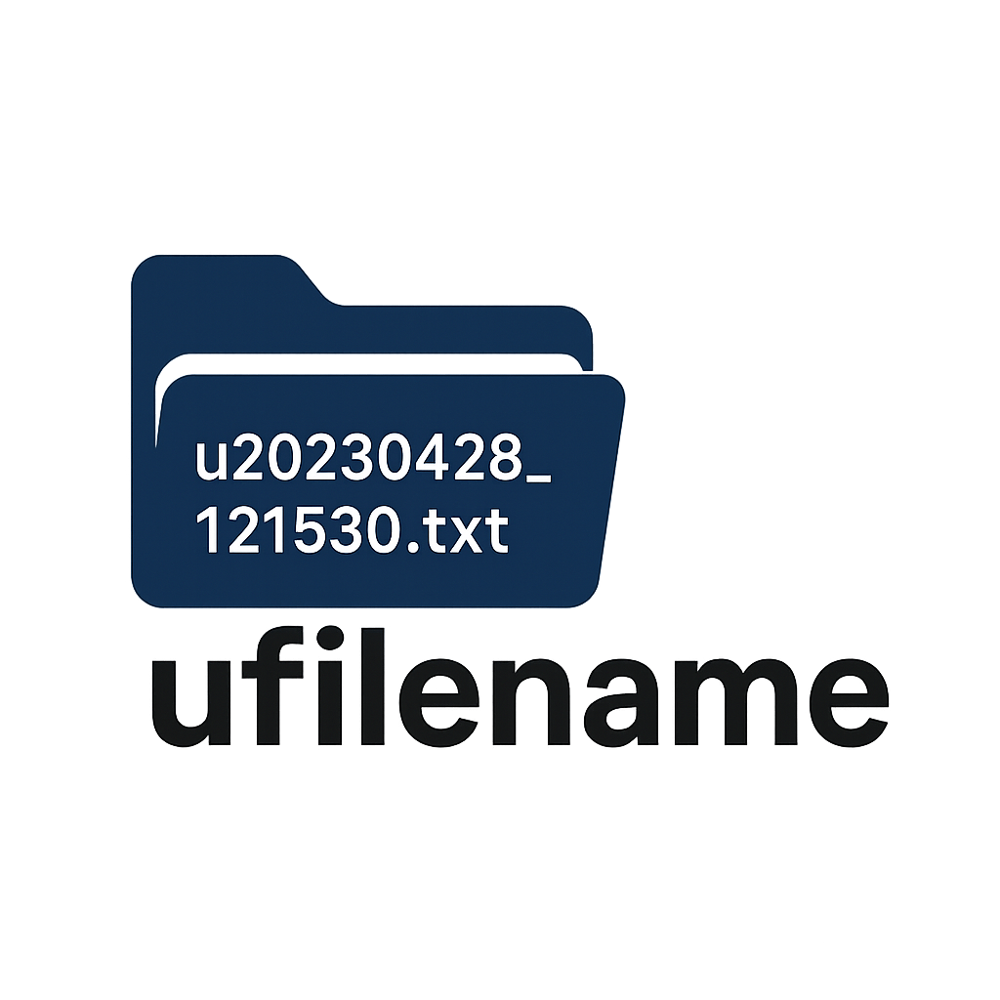

# ufilename



A friendly, lightweight Python library for generating consistent, collision‑resistant filenames through composable policies. It is designed to keep your naming rules explicit, testable, and easy to evolve as your project grows.

## Why `ufilename`?

- **Composable policies**: Combine multiple strategies without duplicating logic.
- **Predictable outputs**: Generate filenames deterministically when you need repeatability.
- **Practical defaults**: Built‑in policies cover common use cases like timestamps, UUIDs, and incremental numbering.
- **Minimal surface area**: One simple helper to build filenames in a clean, consistent way.

## Installation

```bash
pip install ufilename
```

## Quick Start

```python
from ufilename import build_filename, TimestampPolicy

policy = TimestampPolicy()
filename = build_filename(policy, "report", ".pdf")
print(filename)  # e.g., report_20231027_123456.pdf
```

## Core Concepts

`ufilename` separates **what** you want to name from **how** you want to name it:

- **Base name**: the human‑readable portion (e.g., `report`).
- **Extension**: the file type (e.g., `.pdf`).
- **Policy**: a strategy that transforms the base name (e.g., add a timestamp or UUID).

Policies operate on a context object that can optionally include a target directory and metadata. This makes it easy to add logic like “find the next free filename in this folder” or “hash a specific metadata field.”

## Available Policies

- `IdentityPolicy`: Returns the base name unchanged.
- `PrefixPolicy`: Prepends a prefix to the base name.
- `SuffixPolicy`: Appends a suffix to the base name.
- `RandomHexPolicy`: Appends a random hex token.
- `TimestampPolicy`: Appends a timestamp.
- `IncrementPolicy`: Finds the next available numbered file in a directory.
- `UUIDPolicy`: Appends a UUID.
- `HostnamePolicy`: Appends the system hostname.
- `MetadataHashPolicy`: Appends a hash of specific metadata.
- `CompositePolicy`: Chains multiple policies in order.

## Examples

### Prefix + Timestamp

```python
from ufilename import build_filename, CompositePolicy, PrefixPolicy, TimestampPolicy

policy = CompositePolicy([
    PrefixPolicy("daily_"),
    TimestampPolicy("%Y%m%d"),
])

name = build_filename(policy, "report", ".csv")
print(name)  # daily_report_20240217.csv
```

### Increment in a Directory

```python
from pathlib import Path
from ufilename import build_filename, IncrementPolicy

policy = IncrementPolicy(width=3, start=1)
name = build_filename(policy, "backup", ".zip", directory=Path("./backups"))
print(name)  # backup_001.zip (if not taken yet)
```

### Metadata Hash for Reproducibility

```python
from ufilename import build_filename, MetadataHashPolicy

policy = MetadataHashPolicy(key="params", length=8)
name = build_filename(policy, "experiment", ".json", metadata={"params": {"lr": 0.01}})
print(name)  # experiment_1a2b3c4d.json
```

## Serialization

Policies can be serialized to dictionaries and restored later. This is handy when you want to store configuration in JSON/YAML or pass it between services.

```python
from ufilename import policy_from_dict, TimestampPolicy

data = {"type": "timestamp", "fmt": "%Y"}
policy = policy_from_dict(data)
assert isinstance(policy, TimestampPolicy)
```

## Contributing

Contributions are welcome! If you have ideas for additional policies or improvements, feel free to open an issue or submit a pull request.

## License

This project is licensed under the BSD 2‑Clause "Simplified" License. See the `LICENSE` file for details.
